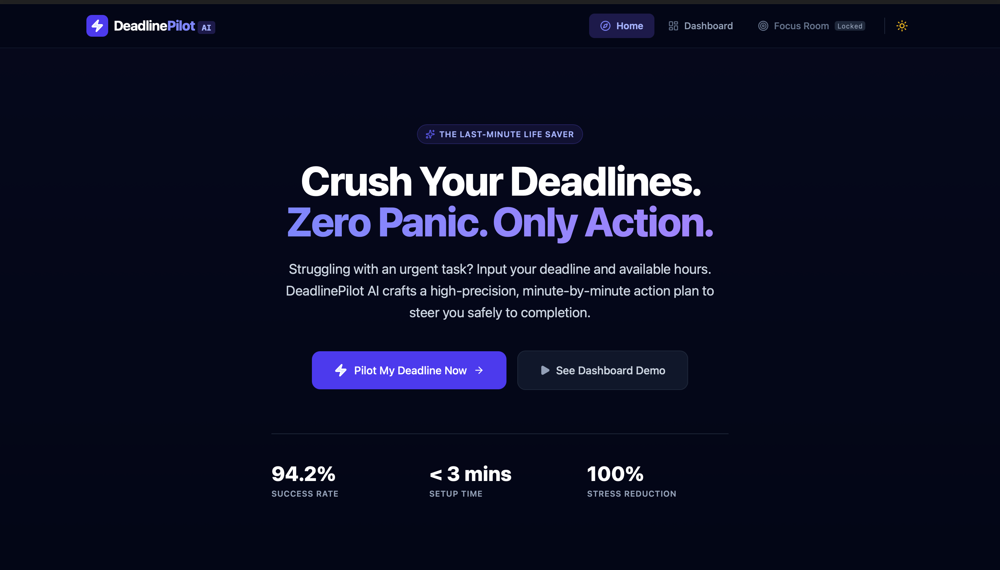
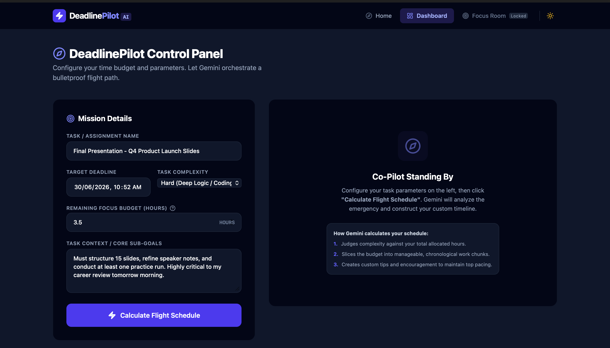
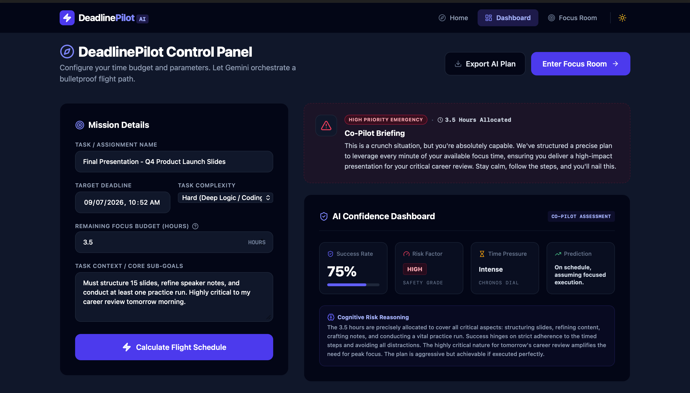
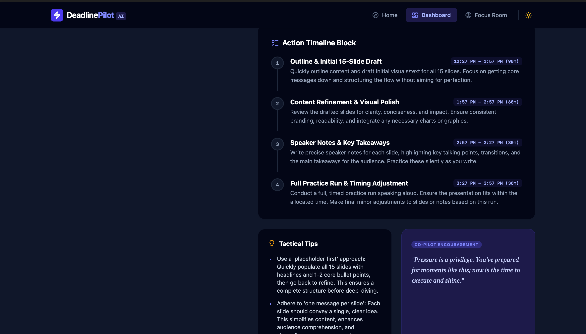
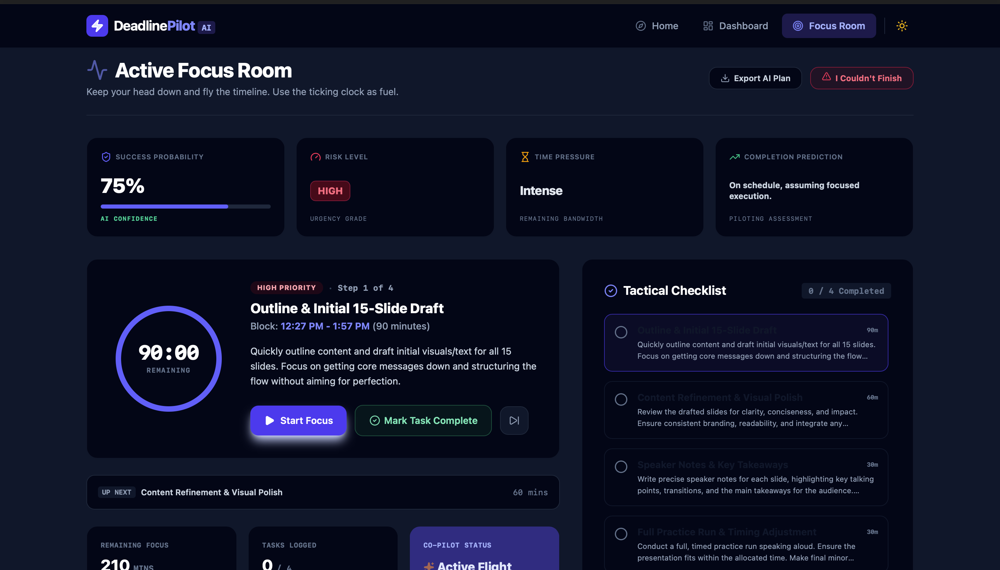
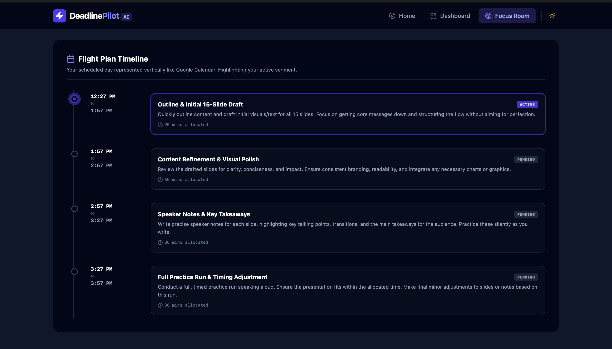

# 🚀 DeadlinePilot AI

> **Crush Your Deadlines. Zero Panic. Only Action.**

DeadlinePilot AI is an AI-powered productivity assistant that transforms overwhelming deadlines into structured, minute-by-minute execution plans using **Google Gemini AI**.

Built for students, professionals, freelancers, and anyone who struggles with last-minute work.

---

## 🌐 Live Demo

👉 Add your live URL here after deployment

```
(https://deadlinepilot-ai-260872934958.asia-southeast1.run.app)
```

---

## ✨ Features

- 🤖 AI-generated task execution plans
- 📅 Deadline-aware scheduling
- ⏱️ Minute-by-minute action timeline
- 🎯 Focus Room with distraction-free workspace
- 🔄 AI Replanning when things change
- 🌙 Dark / Light Mode
- 📊 Task Priority Analysis
- 📈 Progress Tracking
- 🔔 Smart Notifications
- 📤 Export Action Plan
- ⚡ Responsive UI
- ☁️ Google Gemini Integration

---

# 🖥️ Screenshots

## Landing Page

<p align="center">
  
</p>

---

## Dashboard

<p align="center">
  
</p>

---

## AI Generated Plan

<p align="center">
  
</p>

<p align="center">
  
</p>

---

## Focus Room

<p align="center">
  
</p>

<p align="center">
  
</p>

---


# 🧠 How It Works

1. User enters:

- Task Name
- Deadline
- Available Hours
- Difficulty
- Task Context

↓

2. Gemini AI analyses the task.

↓

3. AI generates a structured execution plan.

↓

4. Dashboard visualizes the plan.

↓

5. Focus Mode guides the user until completion.

↓

6. If the deadline changes, AI instantly replans.

---

# 🛠 Tech Stack

## Frontend

- React
- TypeScript
- Vite
- Tailwind CSS
- Framer Motion

## Backend

- Node.js
- Express

## AI

- Google Gemini API

## Deployment

- Google AI Studio
- Google Cloud Run

---

# 📂 Project Structure

```
src/
 ├── components/
 ├── App.tsx
 ├── main.tsx
 ├── types.ts

assets/

server.ts

package.json
```

---

# 🚀 Installation

Clone the repository

```bash
git clone https://github.com/lokeshsahu2804-korba/DeadlinePilotAI.git
```

Go inside

```bash
cd DeadlinePilotAI
```

Install dependencies

```bash
npm install
```

Run locally

```bash
npm run dev
```

---

# 🎯 Future Improvements

- Calendar Integration
- Google Tasks Sync
- Outlook Integration
- Team Collaboration
- Voice Commands
- AI Productivity Analytics
- Mobile App
- Offline Mode

---

# 👨‍💻 Team

**Lokesh Kumar Sahu**

Hackathon Project • 2026

---

# 📄 License

This project is intended for educational and hackathon purposes.

---

# ⭐ If you like this project

Please consider giving this repository a ⭐ on GitHub.
